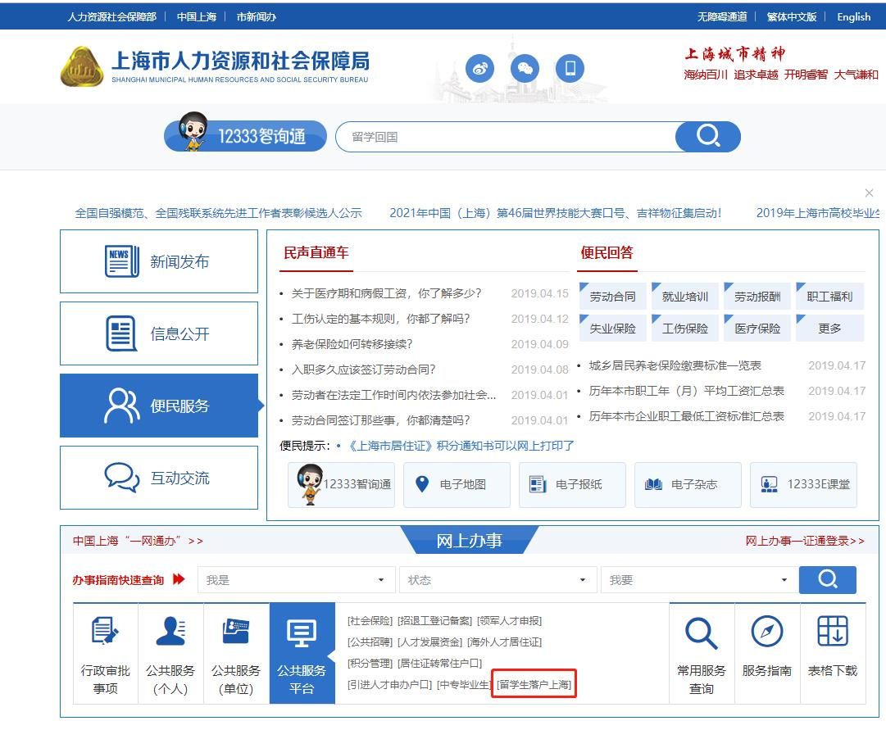
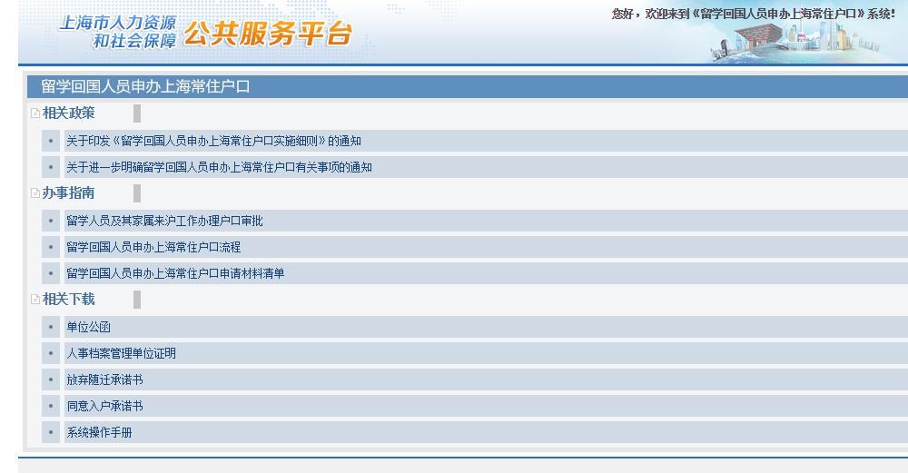

# 留学归国落户政策
[上海市人力资源和社会保障局官网-tel:12333](http://rsj.sh.gov.cn/201712333/index.shtml)

[留学生申办上海常驻户口说明文档总览](http://lxrylh.12333sh.gov.cn/lxssb/default_view.jsp#view2)

>1.[关于印发《留学回国人员申办上海常住户口实施细则》的通知](http://files.shafea.sh.gov.cn/html/2053b6c9-824f-45cb-8c6a-8fe743f73dfe.htm)\
>2.[关于进一步明确留学回国人员申办上海常住户口有关事项的通知](http://files.shafea.gov.cn/html/1d13ad3b-4df6-466a-a3b3-5c2070327905.htm})\
>3.[留学人员及其家属来沪工作办理户口审批](http://files.shafea.gov.cn/html/265deb86-f689-480c-a570-22d4630d1337.htm)\
>4.[留学回国人员申办上海常住户口流程](http://files.shafea.sh.gov.cn/html/3bb6144a-291d-4b8a-bcb5-5c4e2f87e0e0.htm})\
>5.[留学回国人员申办上海常住户口申请材料清单](http://files.shafea.sh.gov.cn/html/11efc15c-b733-4341-a655-511075b7093c.htm)

# 相关落户经验介绍
[留学生优雅落户上海攻略（2019）Zhihu link](https://zhuanlan.zhihu.com/p/56119803)

# Q&A
**Q: 哪些留学人员属于落户申报范围？**\
A: 在国（境）外高校获得本科、学士及以上学历学位（本科学历、学士学位人员累计在国（境）外学习时间须满1年以上；中外合作办学、联合培养等性质毕业生应同时获得国内和国（境）外本科学历、学士学位；不含大专起点本科和HND等形式）；在国内获得硕士研究生及以上学历学位或取得副高级及以上专业技术职务任职资格，赴国（境）外进修、做访问学者满1年（365天）以上的留学回国人员可以申报落户。

**Q: 申报留学人员落户时是否必须要提供《留学回国人员证明》？**\
A: 取得国（境）外高校学历（学位）认证书的留学人员不需要提供。属于进修人员的必须提供国（境）外进修证明（须附具有资质的翻译机构的翻译件）、《留学回国人员证明》和国内硕士研究生及以上学历学位证书或副高级及以上职称证书。

**Q: 哪里可以申请留学生落户预约？**\
A: 如需到上海市人才服务中心申请办理，须在“上海人才”网或微信公众号“上海人才”上预约。（单位资质审核和变更无需预约，现场领取咨询号办理。一个预约号只能办理一位留学生的落户申报业务。咨询柜台不限号，但不办理申请材料递交业务。

**Q: 在沪租房或住在亲友家，单位无集体户，直系亲属也无产权房产的留学人员如何落户？**\
A: 留学人员户口可以落：自有房产、直系家属家庭户、单位集体户或社区公共户。在沪无自有房产或无直系亲属在沪有房产且单位无集体户的留学人员可申请落在居住地的社区公共户。请在请示公函与申请表中注明落“上海市社区公共户”即可，无需另外提供资料。社区公共户相关政策请查询上海市公安局官网。

**Q: 留学生落户对用人单位的要求？**\
A: 申请单位应是在本市行政区域内注册登记的具有用人自主权的党政机关、事业单位、社会团体、民办非企业单位、合伙制事务所以及符合本市产业发展方向、注册资金在100万元人民币及以上、信誉良好，并在本市依法纳税、按规定参加社会保险的各类企业（非企业法人分支机构其上级法人注册资金应不低于100万元人民币）。

**Q: 回国后是否两年内必须来办理留学生落户？**\
A: 不是。回国后至申报上海户口时累计待业时间不能超过两年。回国后若在上海工作，与用人单位签订劳动合同并正常缴纳社保和税，不受两年限制，不是指两年内必须办理落户申请。

# 注意事项
- 关注公司是否具有落户资质，包括注册地、注册资本、诚信状况等
- 注意时间毕业时间与户口办理时间之间的要求